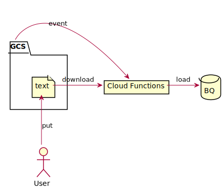

# Google Cloud Functions with Serverless Framework Sample

[BLOG(Japanese)](https://yomon.hatenablog.com/entry/2022/03/cloud_functions_serverless_farmework)



## Requirements

- Serverless Framework
- [Serverless Google Cloud Functions Plugin](https://github.com/serverless/serverless-google-cloudfunctions)


Install serverless framework.

```sh
npm install -g serverless
```

Install serverless plugin for Google Cloud Functions.

```sh
sls plugin install -n serverless-google-cloudfunctions@4.5.0
```

## Try this sample

### Edit config file

```sh
cp ./config.sample.yml config.yml
vim config.yml
```

### Deploy serverless stack

This command will deploy the following resources.

- Cloud Functions
- GCS Bucket
- BigQuery Dataset

```sh
sls deploy
```


### Put a test file to GCS

```sh
gsutil cp ./test_data.txt gs://${TEST_BUCKET}/
```

### Check BigQuery

```sh
bq query "select * from ${TEST_DATASET}.${TEST_TABLE}"
+------+----+------------+
| name | no |    date    |
+------+----+------------+
| foo  |  1 | 2021-01-02 |
| bar  |  2 | 2021-01-07 |
| baz  |  2 | 2022-12-02 |
+------+----+------------+
```


### Clean Up

```sh
bq rm ${TEST_DATASET}.${TEST_TABLE}
gsutil rm gs://${TEST_BUCKET}/**
sls remove
```
